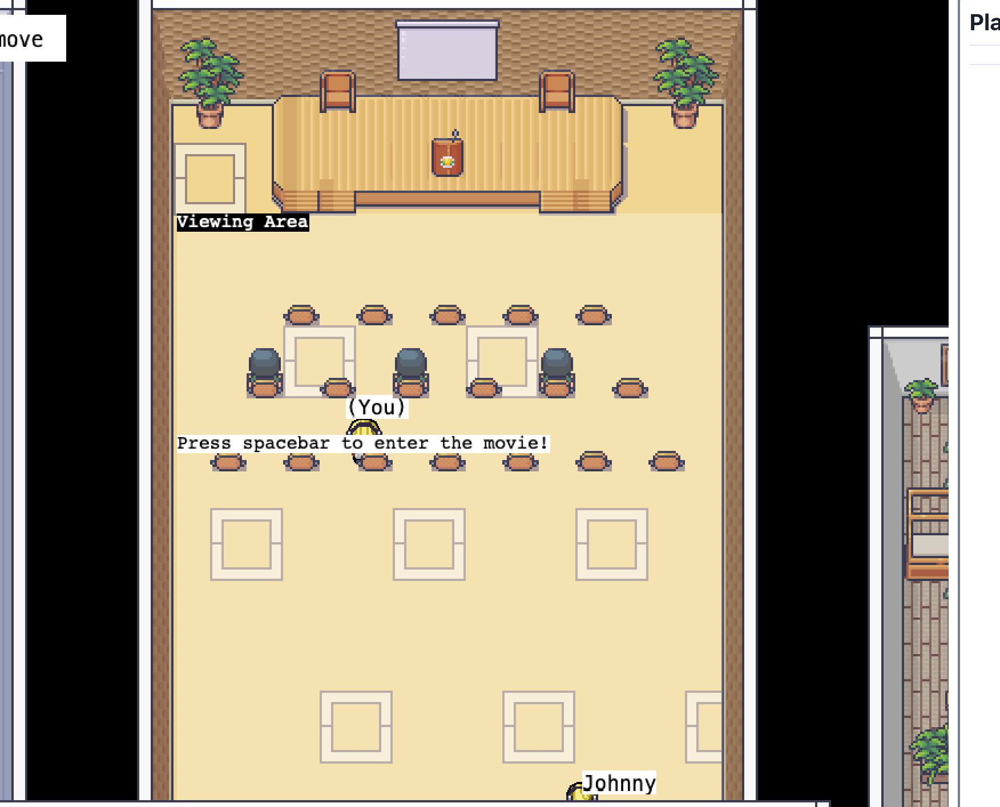
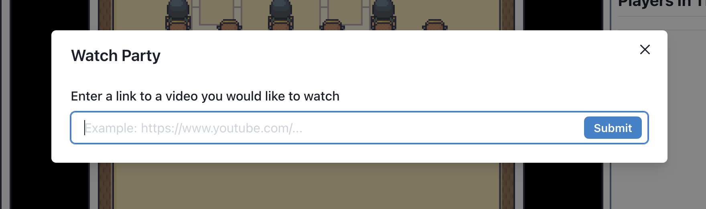
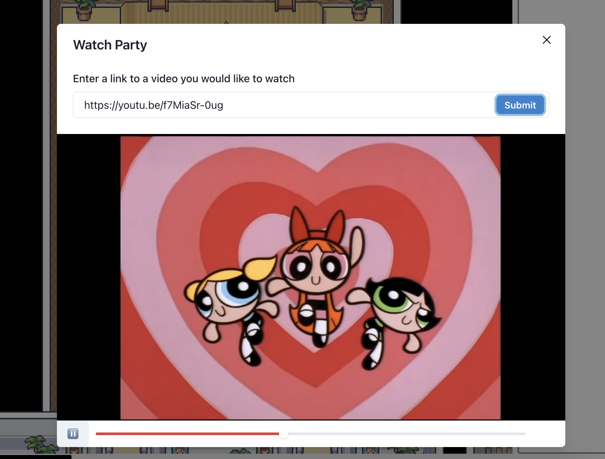
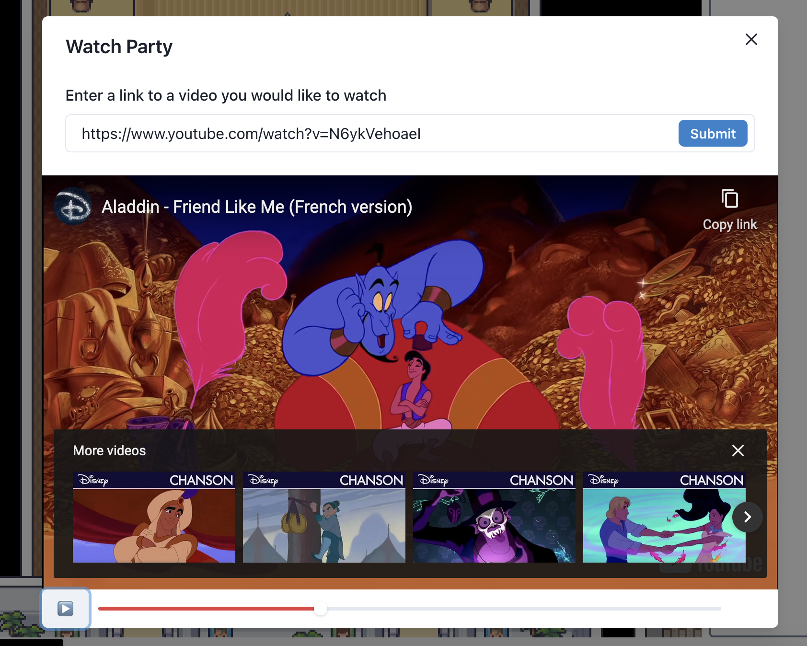

# Viewing Area Usage

Our Viewing Area is a place where many users can view a movie (YouTube video) and have a good time together. To use our viewing Area, the sprite must enter the Viewing Area perimeter located at the top of the world map. Once the user enters the perimeter, he/she must enter spacebar to open the modal. Once the modal opens, the user must enter a valid YouTube URL and the movie starts playing!

- Many users can interact in the viewing area at the same time. 
- All users can control the movie when its playing.

1. Viewing Area

2. Empty URL

3. Video Playing

3. Video Paused

# Covey.Town

Our *Viewing Area* feature does not require any additional or modified configuration compared to the original README.md. The contents of the original README.md for this project stay as is, and are shown below:

Covey.Town provides a virtual meeting space where different groups of people can have simultaneous video calls, allowing participants to drift between different conversations, just like in real life.
Covey.Town was built for Northeastern's [Spring 2021 software engineering course](https://neu-se.github.io/CS4530-CS5500-Spring-2021/), and is designed to be reused across semesters.
You can view our reference deployment of the app at [app.covey.town](https://app.covey.town/) - this is the version that students built on, and our [project showcase](https://neu-se.github.io/CS4530-CS5500-Spring-2021/project-showcase) highlights select projects from Spring 2021.

The figure above depicts the high-level architecture of Covey.Town.
The frontend client (in the `frontend` directory of this repository) uses the [PhaserJS Game Library](https://phaser.io) to create a 2D game interface, using tilemaps and sprites.
The frontend implements video chat using the [Twilio Programmable Video](https://www.twilio.com/docs/video) API, and that aspect of the interface relies heavily on [Twilio's React Starter App](https://github.com/twilio/twilio-video-app-react). Twilio's React Starter App is packaged and reused under the Apache License, 2.0.

A backend service (in the `services/townService` directory) implements the application logic: tracking which "towns" are available to be joined, and the state of each of those towns.

## Running this app locally

Running the application locally entails running both the backend service and a frontend.

### Setting up the backend

To run the backend, you will need a Twilio account. Twilio provides new accounts with $15 of credit, which is more than enough to get started.
To create an account and configure your local environment:

1. Go to [Twilio](https://www.twilio.com/) and create an account. You do not need to provide a credit card to create a trial account.
2. Create an API key and secret (select "API Keys" on the left under "Settings")
3. Create a `.env` file in the `services/townService` directory, setting the values as follows:

| Config Value            | Description                               |
| ----------------------- | ----------------------------------------- |
| `TWILIO_ACCOUNT_SID`    | Visible on your twilio account dashboard. |
| `TWILIO_API_KEY_SID`    | The SID of the new API key you created.   |
| `TWILIO_API_KEY_SECRET` | The secret for the API key you created.   |
| `TWILIO_API_AUTH_TOKEN` | Visible on your twilio account dashboard. |

### Starting the backend

Once your backend is configured, you can start it by running `npm start` in the `services/townService` directory (the first time you run it, you will also need to run `npm install`).
The backend will automatically restart if you change any of the files in the `services/townService/src` directory.

### Configuring the frontend

Create a `.env` file in the `frontend` directory, with the line: `REACT_APP_TOWNS_SERVICE_URL=http://localhost:8081` (if you deploy the towns service to another location, put that location here instead)

### Running the frontend

In the `frontend` directory, run `npm start` (again, you'll need to run `npm install` the very first time). After several moments (or minutes, depending on the speed of your machine), a browser will open with the frontend running locally.
The frontend will automatically re-compile and reload in your browser if you change any files in the `frontend/src` directory.
